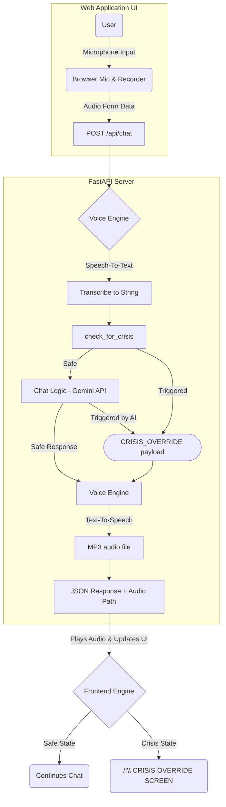

# MindGuard Project Guide

**MindGuard** is a prototype voice-enabled Mental Health Chatbot that integrates proactive crisis detection and emergency protocols. This project demonstrates safety-first AI engineering for delicate user cases.

## Technology Stack
- **Backend**: Python, FastAPI
- **Frontend**: HTML5, Vanilla JavaScript, Tailwind CSS (Glassmorphism design)
- **Voice Capabilities**: `SpeechRecognition` (Google Web Speech API), `gTTS` (Google Text-to-Speech)
- **AI Core**: Google Gemini (`google-generativeai`)

---

## 1. System Architecture



---

## 2. Core Logic & Safety Protcol

It is critical that AI models interacting with vulnerable individuals do not attempt to practice medicine.

**The Watchdog System (`.agents/skills/safety.md`)**:
- Hardcoded string matching on the backend ensures malicious or dangerously worded input instantly triggers.
- The system prompt bounds the Gemini API, requiring it to prefix crisis scenarios with `[CRISIS_OVERRIDE]`.
- Upon this flag, the Frontend logic completely overtakes the interface, disabling chat functionality and aggressively presenting Emergency Services hotlines (e.g., 911, 100, 988, 741741).

---

## 3. How to Run Locally

*Note: Ensure Python 3.10+ is installed.*

1. **Environment Setup**:
   Open a terminal in the project directory and create your virtual environment:
   ```bash
   python -m venv venv
   .\venv\Scripts\activate
   ```

2. **Install Dependencies**:
   ```bash
   pip install -r requirements.txt
   ```

3. **Configure API Keys** (Optional but Recommended):
   Create a `.env` file in the root directory and add your Google Gemini API Key. If none is provided, the system gracefully falls back to a mock responder while still demonstrating the voice capabilities.
   ```env
   GEMINI_API_KEY=your_key_here
   ```

4. **Start the Web Server**:
   ```bash
   uvicorn main:app --reload
   ```

5. **Interact**:
   Open a modern web browser (Edge/Chrome/Firefox) and navigate to: `http://127.0.0.1:8000/`. Allow microphone permissions, click the mic icon, and speak naturally. To test the guardrails, say "I want to hurt myself".
